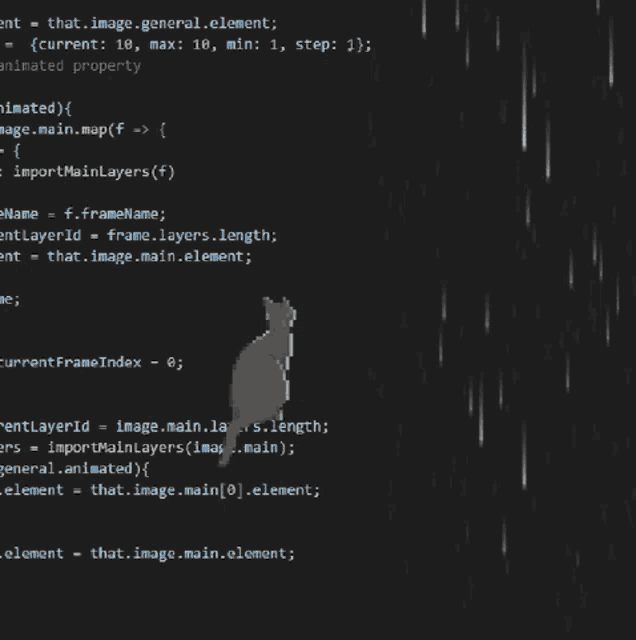

 

## About Me

- 📖 Olá, meu nome é **Nycolas Padilha**, sou de Santa Catarina. Sou *Desenvolvedor Web Júnior*  🖥️  e aluno da  *Formação de Desenvolvimento Web FullStack* na **Trybe**. 

<!-- Contact Info -->

 

****Front End****
  

- 📖 Desenvolvedor *Front End* com foco em **React**, uma poderosa *biblioteca **JavaScript*** de código aberto. Especializado em criar interfaces de usuário dinâmicas e eficientes para páginas web. O projeto é mantido por grandes empresas como **Facebook** e **Instagram**, com colaboração ativa de uma comunidade diversificada de desenvolvedores individuais.

 

****Back End****
  )
  
- 🔙 Sou um desenvolvedor *Back End* com experiência em **NodeJS**, utilizando o *framework* ***Express*** para a construção de servidores web modernos. Aplico o *padrão arquitetônico* **MSC**, organizando responsabilidades em camadas como *model*, *service* e *controller*.
- 🔑 Tenho conhecimento em *autenticação* de rotas utilizando o **JSON Web Token** ou **JWT**. Minha prática de desenvolvimento segue os princípios da *arquitetura* **SOLID** e faço uso do **ORM** ***Sequelize*** para a interação eficiente com o banco de dados.
- 📜 Possuo conhecimentos no *banco de dado* **MySQL**, proporcionando uma base robusta para o armazenamento e recuperação de dados.
- 📖 Recentemente, iniciei a adoção do **TypeScript** em meus projetos, trazendo maior segurança e facilidade de manutenção ao meu código.

  

  <table>
    <tr>
      <th>Primary Skills</th>
    </tr>
    <tr>
      <td align="center">
         
        
         
         
         
      </td>
    </tr>
    <tr>
      <th>Secondary Skills</th>
    </tr>
    <tr>
      <td align="center">
        
         
        
        
        
      </td>
    </tr>
  </table>

 

<!--Most Used Languages -->

  </a>

<!--  -->

  

  ##
<!-- Contact Info -->

  
  

 

  
<!-- Img ot use another Time -->
<!-- Javascript other color

-->
<!-- Rust

-->
<!-- React Native

-->
<!-- Tailwind

-->
<!-- PostgreSQL

-->
<!-- Flask

-->
<!-- Test

-->

<!--
**NyPadilha/NyPadilha** is a ✨ _special_ ✨ repository because its `README.md` (this file) appears on your GitHub profile.

Here are some ideas to get you started:

- 🔭 I’m currently working on ...
- 🌱 I’m currently learning ...
- 👯 I’m looking to collaborate on ...
- 🤔 I’m looking for help with ...
- 💬 Ask me about ...
- 📫 How to reach me: ...
- ⚡ Fun fact: ...
-->
